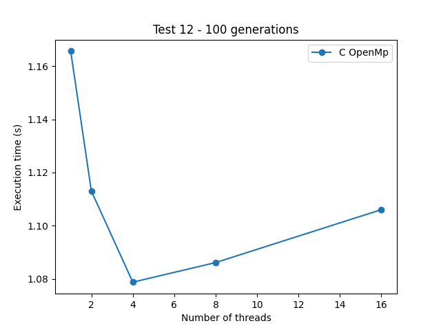

# Game Of Life
TODO descriptions


#### **Implementation details:**
- **p04-gameoflife**, C implementation using OpenMP;


#### **Environment**:

```
OS          Arch Linux x86_64 
Host        XPS 13 9380 
Kernel      5.11.12-arch1-1 
CPU         Intel i7-8565U @ 4.600GHz 
Cores       4
Threads     8
Memory      16GB DDR3
```

#### **Parameters:**
The experiment consisted in averaging the execution times of 5 runs for 
each combination of board and number of threads.

The boards used where all the boards present [here](../p04-gameoflife/tests) (i.e., from 1 to 13).
The numbers of threads used were **1**, **2**, **4**, **6**, **8**, and **16**.


#### **Results:**
  
  

  
  

  
  

